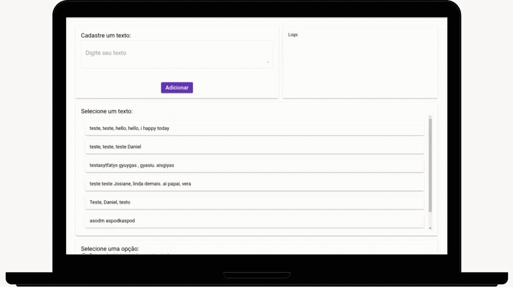

 
<h1> Clustering Words Backend </h1>

<p align="left">
   <a href="https://github.com/danieljpgo">
      
   </a>
   
   <a href="https://github.com/danieljpgo/clustering-words-backend/graphs/contributors">
      
   </a>
  
</p>

> Solves problems related to **Natural Language Processing**. :card_file_box:

----

<p align="center">
   <a href="#memo-project">Project</a>&nbsp;&nbsp;&nbsp;|&nbsp;&nbsp;&nbsp;
   <a href="#computer-integrations">Integrations</a>&nbsp;&nbsp;&nbsp;|&nbsp;&nbsp;&nbsp;
   <a href="#man_technologist-technologies">Technologies</a>&nbsp;&nbsp;&nbsp;|&nbsp;&nbsp;&nbsp;
   <a href="#runner-getting-started">Getting Started</a>&nbsp;&nbsp;&nbsp;|&nbsp;&nbsp;&nbsp;
   <a href="#page_with_curl-license">License</a>
</p>

<h1 align="center">
   
</h1>

## :memo: Project
The project was developed as a challenge to create the **API Rest** that solves the following problems related to **Natural Language Processing**:
- The complete vocabulary formed by the isolated words.
- The complete vocabulary formed by groups of 2 words in sequence **(2-gram)**.
- The numbers **(n)** of word vectors in all documents, considering the vocabulary formed by isolated words.
- The number **(n)** word vectors of all documents, considering the vocabulary formed by groups of 2 words in sequence **(2-gram)**.

## :computer: Integrations
This project is part of the **Clustering Words** ssystem, the other projects are located at:
- [Frontend Clustering Words](https://github.com/danieljpgo/clustering-words-frontend)

## :man_technologist: Technologies
The main technologies used to develop the project were:
- [Node](https://nodejs.org/en/)
- [Express](https://expressjs.com/)
- [Mongodb](https://www.mongodb.com/)
- [Mongoose](https://mongoosejs.com/)

This project was bootstrapped with:
- [Rest](https://github.com/diegohaz/rest)

## :runner: Getting Started
First, make sure you have **[Node](https://nodejs.org/en/)** and **[Mongodb](https://docs.mongodb.com/manual/tutorial/)**, then clone the project with:
```
git clone https://github.com/danieljpgo/clustering-words-backend.git
```

With **[npm](https://nodejs.org/en/knowledge/getting-started/npm/what-is-npm/)**, install dependencies:
```
npm install
```
In order to start the **datebase**, run:
```
sudo service mongod start
```
In order to **start** the application in a development environment, execute:
```
npm run dev
```

Any questions or problems access the links to the main technologies mentioned in <a href="#technologies">Technologies</a>.

## :page_with_curl: License
This project is under the [MIT license](https://github.com/danieljpgo/clustering-words-backend/blob/master/LICENSE).
<div>Released in 2019.</div>
<div>README update in 2020.</div>

Developed by [Daniel Jorge](https://github.com/danieljpgo)
